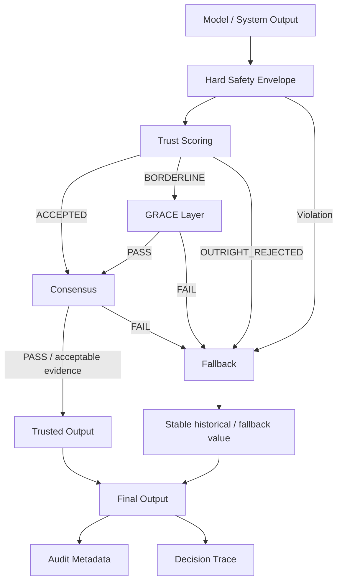
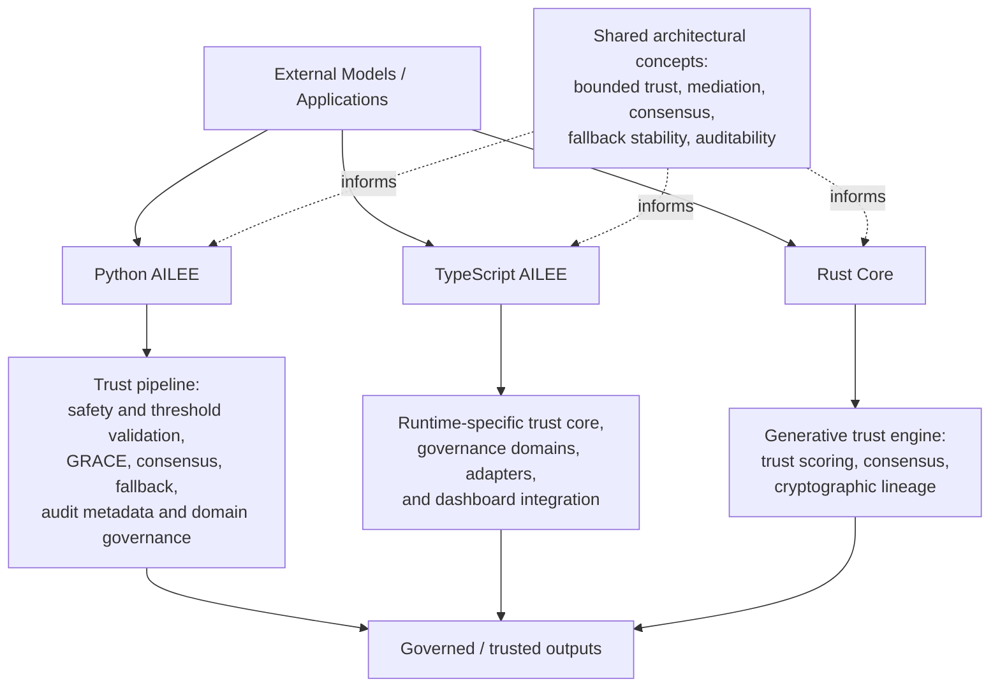
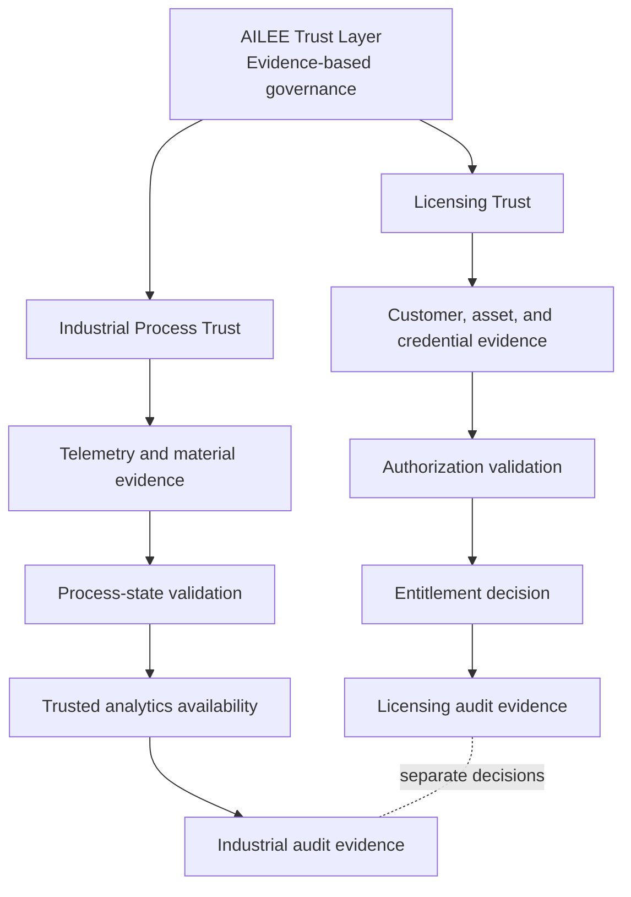
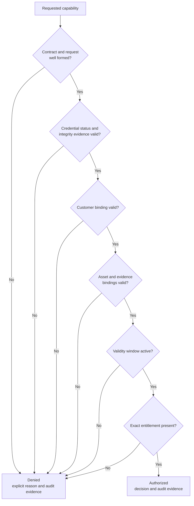
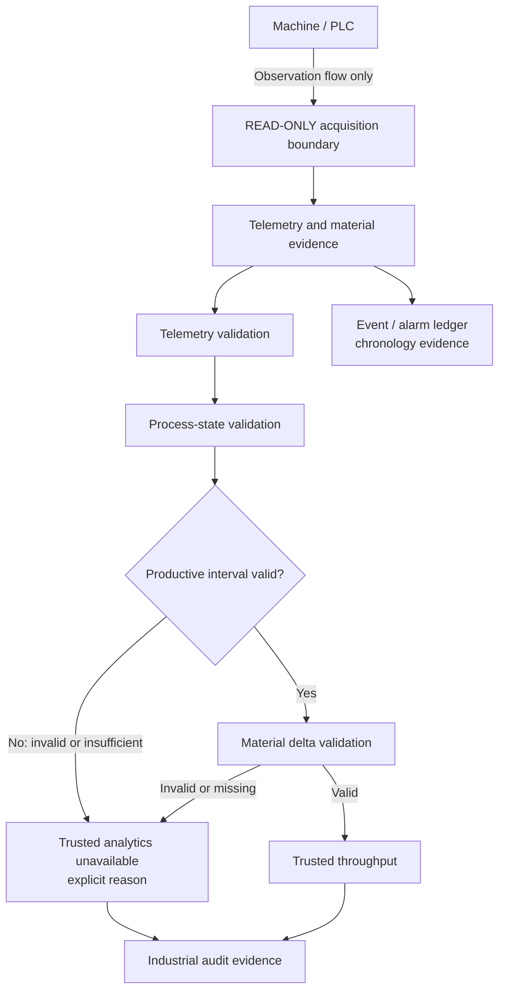
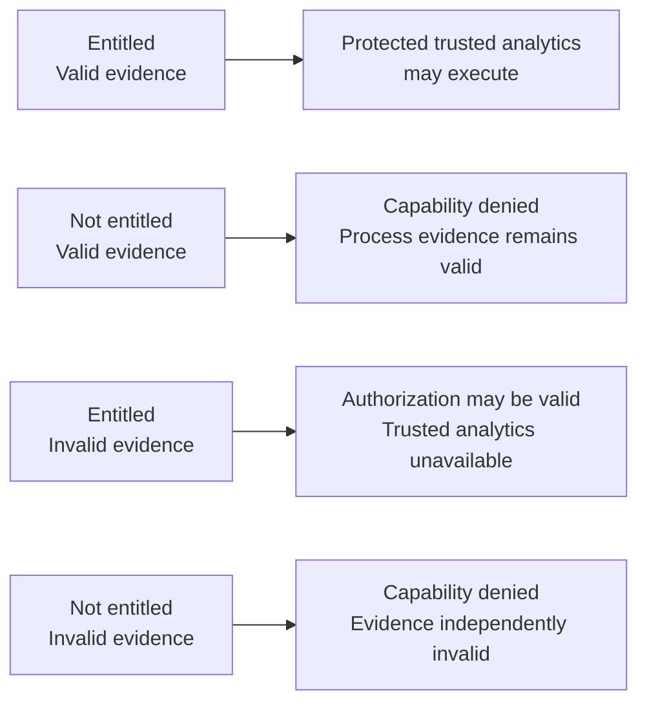

# AILEE Trust Layer
### Adaptive Integrity Layer for AI Decision Systems

[](https://opensource.org/licenses/MIT)
[](https://github.com/dfeen87/ailee-trust-layer)
[](https://www.python.org/)
[](https://github.com/dfeen87/ailee-trust-layer)
---

## Table of Contents

- [What This Is](#what-this-is)
- [Why This Exists](#why-this-exists)
- [Core Architecture](#core-architecture)
- [Rust Core Implementation](#rust-core-implementation)
- [The Mathematics of Trust](#the-mathematics-of-trust)
- [Quick Start](#quick-start)
  - [Installation](#installation)
  - [Basic Usage](#basic-usage)
  - [17 Domain-Optimized Presets](#17-domain-optimized-presets)
  - [Easy AI Framework Integration](#easy-ai-framework-integration)
  - [Advanced Peer Adapters](#advanced-peer-adapters)
  - [Enterprise Monitoring](#enterprise-monitoring)
  - [Comprehensive Serialization](#comprehensive-serialization)
  - [Deterministic Replay](#deterministic-replay)
- [The GRACE Layer](#the-grace-layer-box-2a)
- [Consensus Without Centralization](#consensus-without-centralization)
- [Fallback Is a Feature, Not a Failure](#fallback-is-a-feature-not-a-failure)
- [What AILEE Is Not](#what-ailee-is-not)
- [Guarantees](#guarantees)
- [Project Structure](#project-structure)
- [Unified Trust Interface](#unified-trust-interface-aileeclient)
- [FEEN Hardware Acceleration](#feen-hardware-acceleration)
- [Use Cases](#use-cases)
  - [Core Applications](#core-applications)
  - [Licensing Trust](#-licensing-trust)
  - [Industrial Process Trust](#-industrial-process-trust)
  - [Autonomous & Automotive Systems](#-autonomous--automotive-systems)
  - [Power Grid & Energy Systems](#-power-grid--energy-systems)
  - [Data Center Operations](#-data-center-operations)
  - [Air Flow Domain](#-air-flow-domain)
  - [Topology Systems](#-topology-systems)
  - [Imaging Systems](#-imaging-systems)
  - [Robotics Systems](#-robotics-systems)
  - [Telecommunications Systems](#-telecommunications-systems)
  - [Light Transition Systems](#-light-transition-systems)
  - [Cross-Ecosystem Systems](#-cross-ecosystem-systems)
  - [Governance Systems](#-governance-systems)
  - [Ocean Systems](#-ocean-systems)
  - [Crypto Mining](#-crypto-mining)
  - [Neuro-Assistive & Cognitive Support](#-neuro-assistive--cognitive-support-systems)
  - [Auditory & Assistive Listening Systems](#-auditory--assistive-listening-systems)
  - [CRISPR & Genetic Verification](#-crispr--genetic-verification)
  - [Memory Management Systems](#-memory-management-systems)
  - [Watermark-Provenance-Governance](#-watermark-provenance-governance)
  - [Video Temporal Provenance Engine](#-video-temporal-provenance-engine)
- [AILEE Local Computing](#ailee-local-computing)
- [Design Philosophy](#design-philosophy)
- [Documentation](#documentation)
- [Status & Roadmap](#status--roadmap)
- [Performance](#performance)
- [Contributing](#contributing)
- [Testing](#testing)
- [Continuous Integration](#continuous-integration)
- [License](#license)
- [Citation](#citation)
- [Acknowledgments](#acknowledgments)
- [Contact & Support](#contact--support)
- [Enterprise Consulting & Integration](#enterprise-consulting--integration)
- [Security](#security)

---

## What This Is

**AILEE (AI Load & Integrity Enforcement Engine)** is a **trust middleware** for AI systems.

It sits *between* model output and system action and answers a single question:

> **"Can this output be trusted enough to act on?"**

AILEE does **not** replace models.  
AILEE **governs them**.

It transforms uncertain, noisy, or distributed AI outputs into **deterministic, auditable, and safe decision semantics**.

---

## Why This Exists

Modern AI systems fail *silently*:
- Confidence is treated as truth
- Uncertainty is smoothed instead of surfaced
- One bad output can cascade into system-wide failure

AILEE introduces **structural restraint**.

It enforces:
- ✅ Confidence thresholds
- ✅ Contextual mediation (Grace)
- ✅ Peer agreement (Consensus)
- ✅ Stability-preserving fallback

No guesswork. No hidden overrides.

---

## Core Architecture

This is the high-level trust path: AILEE sits between model or system output and
system action, and determines whether an output is trustworthy enough to act on.



The Mermaid view is intentionally conceptual. The original engineering diagram
below preserves the detailed layer and routing notation, including the numbered
stages.

```
                           1.
                    ┌─────────────────┐
                    │  AILEE Model    │ ········> Raw Data Generation
                    └────────┬────────┘
                             │
                             ↓
        2.          ┌────────────────────────┐
                    │   AILEE SAFETY LAYER   │ ········> —CONFIDENCE SCORING
                    │                        │ ········> —THRESHOLD VALIDATION
                    └─┬──────────┬──────────┬┘ ········> —GRACE LOGIC
                      │          │          │
                 ACCEPTED   BORDERLINE   OUTRIGHT
                      │          │       REJECTED
                      │          │          │
                      │     2A.  ↓          │
                      │     ┌────────┐      │
                      │     │ GRACE  │      │
                      │     │ LAYER  │      │
                      │     └─┬────┬─┘      │
                      │       │    │        │
                      │     PASS  FAIL      │
                      │       │    │        │
                      │       │    └────────┼────────┐
                      │       │             │        │
        3.            ↓       ↓             ↓     4. ↓
                 ┌────────────────────┐  ┌──────────────────┐
                 │ AILEE CONSENSUS    │  │    FALLBACK      │ ········> —ROLLING HISTORICAL
                 │      LAYER         │  │   MECHANISM      │ ········>  MEAN OR MEDIAN
                 └──────┬──────┬──────┘  └────────┬─────────┘ ········> —STABILITY GUARANTEES
                        │      │                  │
          —AGREEMENT    │      │                  │
           CHECK ······>│      │                  │
          —PEER INPUT   │      │                  │
           SYNC ········>│      │                  │
                        │      │                  │
                 CONSENSUS   CONSENSUS             │
                   PASS       FAIL                 │
                        │      │                   │
                        │      └───────────────────┘
                        │                          │
                        │                          │ FALLBACK
                        │                          │  VALUE
                        ↓                          │
        5.          ┌────────────────────────┐    │
                    │ FINAL DECISION OUTPUT  │<───┘
                    │                        │
                    │   —FOR VARIABLE X      │
                    └────────────────────────┘
```

Each layer is **bounded**, **deterministic in its governing decision semantics**,
and **auditable**. Given identical inputs, configuration, and relevant system
state, the governing decision logic is deterministic. Operational metadata such
as timestamps, generated identifiers, and runtime identifiers may vary unless
the caller supplies or controls them.

For architectural theory and system-level rationale, see [docs/whitepaper/](docs/whitepaper/).

---

## Rust Core Implementation

AILEE now includes a **production-grade Rust core** that implements the generative trust engine as a substrate-agnostic library.

### Why Rust?

The Rust implementation provides:
- **Deterministic execution** with zero-cost abstractions
- **Memory safety** without garbage collection
- **Async-first design** for high-performance distributed systems
- **Type-safe trust scoring** with compile-time guarantees
- **No required external service** for offline-capable deployment

### Architecture Overview

AILEE is a multi-runtime project. The runtimes share architectural concepts, but
their capabilities and APIs are not asserted to be identical:



This diagram describes responsibilities, not line-for-line parity. In particular,
the Rust Core provides trust scoring, consensus, and cryptographic lineage for
generative outputs; it is not a replacement for every Python pipeline stage or
domain-governance capability.

```
┌─────────────────────────────────────────────────────────────┐
│                AILEE Trust Layer (Rust Core)                 │
├─────────────────────────────────────────────────────────────┤
│                                                              │
│  GenerationRequest ──► ModelAdapter(s) ──► ModelOutput(s)   │
│                                │                             │
│                                ▼                             │
│                          TrustScorer                         │
│                          (4 dimensions)                      │
│                                │                             │
│                                ▼                             │
│                        ConsensusEngine                       │
│                        (4 strategies)                        │
│                                │                             │
│                                ▼                             │
│                      Cryptographic Lineage                   │
│                         (SHA-256)                            │
│                                │                             │
│                                ▼                             │
│                        GenerationResult                      │
│                                                              │
└─────────────────────────────────────────────────────────────┘
```

### Key Features

#### 1. **Multi-Dimensional Trust Scoring**
Every model output is evaluated across four dimensions:
- **Confidence** (0.0-1.0): Model certainty and output quality
- **Safety** (0.0-1.0): Content safety and error detection
- **Consistency** (0.0-1.0): Similarity to historical outputs
- **Determinism** (0.0-1.0): Repeatability indicators

```rust
let mut scorer = TrustScorer::new();
let score = scorer.score_output(&output);
// score.aggregate_score combines all dimensions with weighted average
```

#### 2. **Consensus Strategies**
Four built-in strategies for intelligent output selection:
- **HighestTrust**: Select output with best trust score
- **MajorityVote**: Choose most common output (Byzantine fault tolerance)
- **Synthesize**: Combine multiple outputs intelligently
- **WeightedCombination**: Weight outputs by trust scores

```rust
let consensus = ConsensusEngine::new(ConsensusStrategy::HighestTrust)
    .with_trust_threshold(0.75)
    .reach_consensus(&outputs, &trust_scores);
```

#### 3. **Cryptographic Verification**
Every generation produces a SHA-256 hash over:
- The complete request (including prompt and parameters)
- All model outputs (in deterministic sorted order)
- The final selected/synthesized output
- Timestamp and execution metadata

```rust
let lineage = Lineage::build(&request, &outputs, &final_output);
// Later: verify authenticity
assert!(lineage.verify(&request, &outputs, &final_output));
```

#### 4. **Substrate-Agnostic Design**
The Rust core makes **zero assumptions** about:
- Network topology or routing
- Node lifecycle management  
- Distributed coordination
- Execution environment

It provides clean `ModelAdapter` traits that any substrate (like Ambient AI VCP) can implement.

### Quick Start (Rust)

```rust
use ailee_trust_core::prelude::*;

// 1. Create request
let request = GenerationRequest::new("prompt", TaskType::Code)
    .with_trust_threshold(0.75)
    .with_execution_mode(ExecutionMode::Hybrid);

// 2. Generate from models (implement ModelAdapter trait)
let outputs = generate_from_models(&request).await;

// 3. Score outputs
let mut scorer = TrustScorer::new();
let scores = scorer.score_outputs(&outputs);

// 4. Reach consensus
let consensus = ConsensusEngine::new(ConsensusStrategy::HighestTrust)
    .reach_consensus(&outputs, &scores);

// 5. Build cryptographic lineage
let lineage = Lineage::build(&request, &outputs, &consensus.output);

// 6. Create verified result
let result = GenerationResult {
    final_output: consensus.output,
    aggregate_trust_score: consensus.trust_score,
    model_trust_scores: scores,
    lineage,
    execution_metadata: HashMap::new(),
};
```

### Documentation & Examples

- **Full Documentation**: See [docs/RUST_README.md](docs/RUST_README.md)
- **Quick Start Guide**: See [QUICKSTART.md](QUICKSTART.md)
- **Complete Example**: `cargo run --example complete_workflow`
- **Implementation Summary**: See [docs/RUST_IMPLEMENTATION_SUMMARY.md](docs/RUST_IMPLEMENTATION_SUMMARY.md)

### Quality Metrics

✅ **Unit and integration tests included**
✅ **Rustfmt and Clippy checks supported**
✅ **Fully async** with tokio runtime  
✅ **Minimal dependencies** (tokio, serde, sha2, async-trait, thiserror)

### Relationship to Python Implementation

- **Python**: High-level decision pipeline, domain adapters, rapid prototyping
- **Rust Core**: Low-level trust engine, consensus, cryptographic verification
- **Integration**: Python can call Rust via FFI or run Rust as a service

The Rust core is designed to be the **deterministic foundation** that execution substrates build upon.

---

## The Mathematics of Trust

AILEE is grounded in a systems-first philosophy originally developed for adaptive propulsion, control systems, and safety-critical engineering.

At its core is the idea that **output confidence must be integrated over time, energy, and system state**, not treated as a single scalar.

This principle is captured by the governing equation:

```
Δv = Iₛₚ · η · e⁻ᵅᵛ₀² ∫₀ᵗᶠ [Pᵢₙₚᵤᵗ(t) · e⁻ᵅʷ⁽ᵗ⁾² · e²ᵅᵛ₀ · v(t)] / M(t) dt
```

### Interpretation (System-Level)

| Variable | Meaning |
|----------|---------|
| **Δv** | Net trusted system movement (decision momentum) |
| **Iₛₚ** | Structural efficiency of the model |
| **η** | Integrity coefficient (how well the system preserves truth) |
| **α** | Risk sensitivity parameter |
| **v(t)** | Decision velocity over time |
| **M(t)** | System mass (inertia, history, stability) |
| **Pᵢₙₚᵤᵗ(t)** | Input energy (model output signal) |

In AILEE:
- Decisions are **earned**, not assumed
- Confidence decays under risk
- Stability is a conserved quantity

This is not metaphorical math.  
It is **systems governance applied to AI outputs**.

---

## Quick Start

### Installation

```bash
pip install ailee-trust-layer
```

### Basic Usage

```python
from ailee import create_pipeline, LLM_SCORING

# Create a pre-configured pipeline
pipeline = create_pipeline("llm_scoring")

# Or use explicit configuration
from ailee import AileeTrustPipeline, AileeConfig

config = AileeConfig(
    borderline_low=0.70,
    borderline_high=0.90
)
pipeline = AileeTrustPipeline(config)

# Process model output through the trust layer
result = pipeline.process(
    raw_value=10.5,
    raw_confidence=0.75,
    peer_values=[10.3, 10.6, 10.4],
    context={"feature": "temperature", "units": "celsius"}
)

# Consume trusted output
print(result.value)            # Final trusted value
print(result.safety_status)    # ACCEPTED | BORDERLINE | OUTRIGHT_REJECTED
print(result.used_fallback)    # True if fallback was used
print(result.reasons)          # Human-readable decision trace
```

---

### 17 Domain-Optimized Presets

Pre-tuned configurations for production deployment:

```python
from ailee import (
    # LLM & NLP
    LLM_SCORING, LLM_CLASSIFICATION, LLM_GENERATION_QUALITY,
    # Sensors & IoT
    SENSOR_FUSION, TEMPERATURE_MONITORING, VIBRATION_DETECTION,
    # Financial
    FINANCIAL_SIGNAL, TRADING_SIGNAL, RISK_ASSESSMENT,
    # Medical
    MEDICAL_DIAGNOSIS, PATIENT_MONITORING,
    # Autonomous
    AUTONOMOUS_VEHICLE, ROBOTICS_CONTROL, DRONE_NAVIGATION,
    # General
    CONSERVATIVE, BALANCED, PERMISSIVE,
)

# Instant production config
pipeline = create_pipeline("medical_diagnosis")
```

### Easy AI Framework Integration

AILEE integrates seamlessly with popular AI frameworks:

```python
from openai import OpenAI
from ailee import AileeTrustPipeline, AileeConfig
from ailee import OpenAIAdapter

# Setup
client = OpenAI()
pipeline = AileeTrustPipeline(AileeConfig())
adapter = OpenAIAdapter(use_logprobs=True)

# Get AI response
response = client.chat.completions.create(
    model="gpt-4",
    messages=[{"role": "user", "content": "Rate quality 0-100: ..."}],
    logprobs=True
)

# Extract and validate through AILEE
ai_response = adapter.extract_response(response)
result = pipeline.process(
    raw_value=ai_response.value,
    raw_confidence=ai_response.confidence,
    context={"model": "gpt-4"}
)

# Use validated output
if not result.used_fallback:
    safe_value = result.value  # Trusted AI output
```

**Supported Frameworks:**
- ✅ **OpenAI** (GPT-4, GPT-3.5, etc.) - with logprob confidence extraction
- ✅ **Anthropic** (Claude) - with stop_reason analysis
- ✅ **Google Gemini** (Gemini Pro, Gemini Pro Vision) - with safety ratings integration
- ✅ **HuggingFace** (Transformers) - classification, generation, QA
- ✅ **LangChain** - seamless chain integration

**Multi-Model Consensus:**

```python
from ailee import create_multi_model_ensemble, OpenAIAdapter, AnthropicAdapter

# Create ensemble
ensemble = create_multi_model_ensemble()

# Add responses from different AI models
ensemble.add_response("gpt4", gpt4_response, OpenAIAdapter())
ensemble.add_response("claude", claude_response, AnthropicAdapter())

# Get consensus-validated decision
primary_value, peer_values, confidences = ensemble.get_consensus_inputs()
result = pipeline.process(
    raw_value=primary_value,
    raw_confidence=max(confidences.values()),
    peer_values=peer_values
)
```

📖 **[Full AI Integration Guide →](docs/AI_INTEGRATION_GUIDE.md)** - Step-by-step guides for OpenAI, Anthropic, HuggingFace, and LangChain

### Advanced Peer Adapters

Multi-model consensus made simple:

```python
from ailee import create_multi_model_adapter

# Multi-model ensemble in 3 lines
outputs = {"gpt4": 10.5, "claude": 10.3, "llama": 10.6}
confidences = {"gpt4": 0.95, "claude": 0.92, "llama": 0.88}
adapter = create_multi_model_adapter(outputs, confidences)
```

### Enterprise Monitoring

Real-time observability and alerting:

```python
from ailee import AlertingMonitor, PrometheusExporter

# Production alerting
def alert_handler(alert_type, value, threshold):
    logger.critical(f"AILEE ALERT: {alert_type} = {value:.2f}")

monitor = AlertingMonitor(
    fallback_rate_threshold=0.30,
    min_confidence_threshold=0.70,
    alert_callback=alert_handler
)

# Prometheus integration
exporter = PrometheusExporter(monitor)
metrics = exporter.export()  # Serve at /metrics
```

### Comprehensive Serialization

Audit trails for compliance:

```python
from ailee import decision_to_audit_log, decision_to_csv_row

# Human-readable audit logs
audit_entry = decision_to_audit_log(result, include_metadata=True)
logger.info(audit_entry)

# CSV export for analysis
with open('audit.csv', 'w') as f:
    f.write(decision_to_csv_row(result, include_header=True))
```

### Deterministic Replay

Regression testing and debugging:

```python
from ailee import ReplayBuffer

buffer = ReplayBuffer()
buffer.record(inputs, result)
buffer.save('replay_20250117.json')

# Test config changes
new_pipeline = create_pipeline("conservative")
comparison = buffer.compare_replay(new_pipeline, tolerance=0.001)
print(f"Match rate: {comparison['match_rate']:.2%}")
```

---

## The GRACE Layer (Box 2A)

The GRACE Layer activates **only when confidence is borderline**.

It does not guess.  
It evaluates **plausibility under context**.

GRACE applies:
- ✓ Trend continuity checks
- ✓ Short-horizon forecasting
- ✓ Peer-context agreement

Grace is **not leniency**.  
Grace is **disciplined mediation under uncertainty**.

If GRACE fails → the system falls back safely.

**[Read more about GRACE →](docs/GRACE_LAYER.md)**

---

## Consensus Without Centralization

AILEE supports **peer-based agreement** without requiring:
- ❌ Blockchain
- ❌ Global synchronization
- ❌ Shared state

Consensus is local, bounded, and optional.

If peers disagree → no forced decision.

---

## Fallback Is a Feature, Not a Failure

Fallback mechanisms guarantee:
- System continuity
- Output stability
- No catastrophic jumps

Fallback values are derived from:
- Rolling median
- Rolling mean
- Last known good state

Fallback is **intentional restraint**.

---

## What AILEE Is Not

AILEE is **not**:
- ❌ A model
- ❌ A training framework
- ❌ A probabilistic smoother
- ❌ A heuristic patch
- ❌ A black box

AILEE is **governance logic**.

---

## Guarantees

AILEE guarantees:
- ✅ Deterministic governing decisions for identical inputs, configuration, and relevant state
- ✅ Explainable decisions
- ✅ No silent overrides
- ✅ No unsafe escalation
- ✅ Full auditability

If the system acts, you can explain **why**.

Timestamps, generated decision IDs, and other operational metadata are not part
of this semantic determinism guarantee unless they are supplied or controlled by
the caller.

---

## Project Structure

```
ailee-trust-layer/
├── ailee/                         # Core Python Trust Library & Governance Framework
│   ├── domains/                   # 18 Domain Governance Modules (Automotive, Datacenter, Memory, Video, etc.)
│   ├── local_computing/           # Foundational common, Linux, Windows, and macOS trust governance
│   ├── governance_v1/             # Microservice Governance Engine & ALCOA Hash-Chained Ledger
│   └── optional/                  # Presets, Adapters, Monitors, Serialization, Replay, AI Integrations
├── include/                       # C++ Engine Headers (Video Temporal Provenance Engine C ABI)
├── src/                           # Rust Core Engine (`ailee_trust_core`) & C++ Engine Source (`ailee_video_temporal_provenance`)
├── packages/ailee-ts/             # `@ailee/trust-layer` TypeScript Adapter Package & Governance Dashboard
├── docs/                          # Architecture Whitepapers & Domain Specifications
├── app.py                         # FastAPI Production Server Entry Point
└── index.html                     # Web Interface
```

---

## Unified Trust Interface (`AileeClient`)

AILEE provides a single, stable entrypoint for trust validation through the **`AileeClient`** interface.

`AileeClient` abstracts backend selection and orchestration, allowing applications to use the AILEE Trust Layer without coupling to a specific execution model. The client automatically selects the most appropriate backend at runtime while preserving AILEE’s canonical trust semantics.

### Key properties

- **Single ingress point** for all trust evaluations  
- **Backend‑agnostic API** (software, FEEN hardware, future accelerators)  
- **Deterministic behavior** with full audit metadata  
- **Safe fallback** to the reference software pipeline when hardware is unavailable  
- **No semantic drift** — AILEE remains the source of truth for trust decisions  

### Example usage

```python
from ailee import AileeClient, AileeConfig

client = AileeClient(
    AileeConfig(hard_min=0.0, hard_max=100.0)
)

result = client.process(
    raw_value=42.1,
    raw_confidence=0.93,
    peer_values=[41.9, 42.0, 42.2],
    context={"feature": "latency_ms"},
)
```

Backend selection can also be controlled via environment variable:

```bash
export AILEE_BACKEND=feen      # or "software"
```

---

## FEEN Hardware Acceleration

AILEE supports optional hardware acceleration via **FEEN (The Phononic Wave Engine)**.

FEEN provides a wave‑native, physics‑informed computing substrate that can implement core AILEE trust primitives—such as confidence scoring, thresholding, and consensus—directly in hardware using nonlinear resonator dynamics. When available, FEEN acts as a transparent accelerator beneath `AileeClient`, delivering ultra‑low latency and power consumption while preserving AILEE’s trust semantics.

- FEEN is **optional** and **non‑intrusive**
- Software remains the canonical reference implementation
- Hardware acceleration is enabled without changing application code

🔗 **FEEN Repository:** [dfeen87/feen](https://github.com/dfeen87/feen)

---

## Use Cases

AILEE is designed for scenarios where **uncertainty meets consequence** — systems where decisions must be **sufficiently trustworthy, explainable, and safe** before they are acted upon.

### Core Applications

- 🤖 **LLM scoring and ranking** — Validate model outputs before user-facing deployment  
- 🏥 **Medical decision support** — Ensure diagnostic reliability under uncertainty  
- 💰 **Financial signal validation** — Prevent erroneous or unstable trading decisions  
- 🌐 **Distributed AI consensus** — Multi-agent agreement without centralization  
- ⚙️ **Safety-critical automation** — Deterministic governance for high-risk systems  

---

### 🔐 Licensing Trust

Version 9.3 extends AILEE with two distinct, evidence-based governance domains:
**Licensing Trust** decides whether a customer and asset may use a protected
capability, while **Industrial Process Trust** decides whether machine evidence
supports trusted process analytics. Both produce deterministic decisions,
machine-readable reasons, and audit evidence for the same inputs and dependency
state. They retain separate semantics and are never reduced to one aggregate
trust score.



#### Authorization model

Licensing Trust governs whether a customer, system, or asset is authorized to
use a particular licensed capability. The conceptual chain is **customer →
license → credential evidence → asset binding → entitlements → requested
capability → authorization decision → audit evidence**. Merely presenting a
license is not authorization.

The fail-closed governor validates the contract and request, upstream credential
status and evidence bindings, customer and asset bindings, the half-open
validity window, and exact entitlement membership. Protected commercial
capabilities are authorized only after every required check passes. Both
authorization and denial carry an explicit machine-readable reason, a
deterministic decision identifier, and provenance-oriented audit evidence. The
default verifier consumes an upstream credential status; cryptographic
signature validation and key management must be supplied by an integration and
are not claims of the built-in verifier.



---

### 🏭 Industrial Process Trust

Industrial Process Trust is a vendor-neutral, supervisory/read-only governance
path for machine telemetry and derived analytics. Its conceptual chain is
**machine or PLC → external read-only adapter → telemetry evidence →
process-state governance → validated productive time → trusted throughput →
audit evidence**. The event ledger is a separate output that provides
deterministic chronology; it does not infer root cause and is neither a
throughput input nor part of `IndustrialAuditEvidence`. Consumers that need a
combined audit view must retain the original `ProcessInterval`, join each
throughput audit record to it by `interval_id`, and then correlate ledger events
whose `machine_id` matches and whose occurrence timestamp falls within that
interval's `start` and `end`. The audit record's `evaluated_at` is the evaluation
time, not an interval boundary, and must not be used for this correlation.

Raw telemetry is evidence, not automatically trusted truth. AILEE validates
identity, source and schema constraints, timestamps, freshness, process state,
machine binding, material observations, and other configured policy conditions
before making analytics available. Machine settings such as RPM do not, by
themselves, establish physical material throughput.



Conceptually, for an accepted interval:

```text
trusted throughput = validated material quantity change / validated productive time
```

The implementation reports the rate per hour using validated productive
seconds. Productive time excludes intervals that do not satisfy the required
evidence and policy conditions—for example, faulted, non-running, stale, or
otherwise invalid intervals. Signal/source allowlists, freshness, transitions,
and related policy choices may be configured for the integrated machine and
process environment; integrations remain responsible for applying policies not
coupled directly to the interval governor.

#### Independent, orthogonal trust

Authorization trust and process-evidence trust are independent. A valid license
does not make telemetry valid, and valid telemetry does not grant an
entitlement. The composed service permits protected trusted analytics only when
authorization succeeds **and** trusted throughput is available, while retaining
both decisions and their reasons separately.



> **VALID LICENSE ≠ VALID TELEMETRY. VALID TELEMETRY ≠ ENTITLEMENT.**

#### Safety and scope boundary

> **The Industrial Process Trust Domain is supervisory/read-only.** AILEE v9.3
> does not replace PLC safety logic or emergency-stop systems; bypass interlocks
> or machine guards; command industrial hardware through this domain; suppress
> native machine alarms; or constitute machine-safety or regulatory
> certification. A commercial licensing failure is independent of native
> machine safety behavior.

For the complete model and its evidence boundaries, see:

- **[Domain Governance](docs/DOMAIN_GOVERNANCE.md)** — authoritative architecture,
  invariants, trust boundaries, evidence semantics, domain behavior, and
  limitations.
- **[Simulation and Validation](docs/SIMULATION_AND_VALIDATION.md)** — executed
  scenarios, cross-domain simulations, adversarial validation, observed
  outcomes, reproducibility information, and known limitations.

---

### 🚗 Autonomous & Automotive Systems

AILEE provides a **governance layer** for AI-assisted and autonomous vehicles, ensuring that
automation authority is granted only when safety, confidence, and system health allow.

**Governed Decisions**
- Autonomy level authorization (manual → assisted → constrained → full)
- Model confidence validation before control escalation
- Multi-sensor and multi-model consensus
- Safe degradation and human handoff planning

**Typical Use Cases**
- Autonomous driving integrity validation
- Advanced driver-assistance systems (ADAS)
- Fleet-level AI oversight and compliance logging
- Simulation, SIL/HIL, and staged deployment validation

> AILEE **does not drive the vehicle** — it determines *how much autonomy is allowed* at runtime.

---

### ⚡ Power Grid & Energy Systems

AILEE enables **deterministic, auditable governance** for AI-assisted power grid and energy operations.

**Governed Decisions**
- Grid authority level authorization (manual → assisted → constrained → autonomous)
- Safety validation using frequency, voltage, reserves, and protection status
- Operator readiness and handoff capability checks
- Scenario-aware policy enforcement (peak load, contingencies, disturbances)

**High-Impact Applications**
- Grid stabilization and disturbance recovery
- AI-assisted dispatch and forecasting oversight
- Microgrid and islanded operation governance
- Regulatory-compliant decision logging (NERC, IEC, ISO)

> AILEE **never dispatches power** — it defines the maximum AI authority permitted at any moment.

---

### 🏢 Data Center Operations

AILEE provides deterministic governance for AI-driven data center automation.

**High-Impact Applications**
- ❄️ **Cooling optimization** — Reduce energy use while maintaining thermal safety  
- ⚡ **Power capping** — Control peak demand without SLA violations  
- 📊 **Workload placement** — Safe live migration and carbon-aware scheduling  
- 🔧 **Predictive maintenance** — Reduce false positives and extend hardware lifespan  
- 🚨 **Incident automation** — Faster MTTR with full accountability  

**Typical Economic Impact (5MW Facility)**
- PUE improvement: **1.58 → 1.32** (≈16%)
- Annual savings: **$1.9M+**
- Payback period: **< 2 months**
- Year-1 ROI: **650%+**

---

### 🧪 Air Flow Domain

AILEE v8.3 introduces adaptive calibration behavior and predictive stability scoring to the Air Flow Domain.
The trust pipeline now anticipates degraded or hazardous states before they occur, tightening guard behavior and improving safety determinism. All adaptive logic is strictly hardened and reverts to static v8.2 behavior when telemetry is malformed or insufficient.

AILEE provides deterministic physical governance, safety-bounds enforcement, telemetry ingestion, and fieldbus payload parsing for **precision air and process-gas flow systems** such as mass-flow, pressure, and ultrasonic-flow controllers in semiconductor fabrication and chemical process control lines. The included byte layout is a repository reference profile, not a claim of universal compatibility with commercial controllers.

```
┌─────────────────────────────────────────────────────────────┐
│                      Air Flow Domain                      │
├─────────────────────────────────────────────────────────────┤
│                                                             │
│  Fieldbus Data (EtherNet/IP CIP / EtherCAT PDO)             │
│                         │                                   │
│                         ▼                                   │
│            Hardware Offset Manifests                        │
│       (reference_mfc_manifest.json / gas_db.json)         │
│                         │                                   │
│                         ▼                                   │
│              Pure TS Zero-Allocation                        │
│              Telemetry Schema Validators                    │
│                         │                                   │
│                         ▼                                   │
│           Deterministic Safety Rule Engine                  │
│       • RampRateGuard   • ZeroDriftGuard                     │
│       • PressureGuard   • PressureDeltaGuard                 │
│       • GasSafetyGuard                                      │
│                         │                                   │
│                         ▼                                   │
│             AILEE Trust Pipeline Process                    │
│                         │                                   │
│                         ▼                                   │
│           Deterministic Hardware Fallback                   │
│   • Hazardous Line Breach   ──► VALVE_CLOSE (Isolation)     │
│   • Inert Line Drift        ──► VALVE_HOLD  (Maintain)      │
│                                                             │
└─────────────────────────────────────────────────────────────┘
```

#### High-Impact Physical Safety Features
- 🛡️ **Zero-Dependency Pure TS Execution**: Sub-2ms synchronous evaluation loops operating with zero external runtime dependencies.
- 📡 **Manifest-Driven Fieldbus Adapters**: Byte buffer parsers for EtherNet/IP CIP (`adapters/ethernet_ip.ts`) and EtherCAT PDO (`adapters/ethercat.ts`), configured via the repository-defined `configs/reference_mfc_manifest.json` reference layout.
- ⚗️ **8-Gas Process Database**: Pre-populated catalog (`models/gas_database.ts` backed by `configs/gas_db.json`) covering $N_2$, Air, Argon, $H_2$, $NH_3$, $O_2$, $SiH_4$, and $Cl_2$ with Gas Correction Factors (GCF), safety classifications (`INERT`, `FLAMMABLE`, `TOXIC`, `CORROSIVE`, `OXIDIZER`, `PYROPHORIC`), max flow ceilings, and mandatory purge-on-switch flags.
- ⚡ **Physical Guard Rules**:
  - `RampRateGuard`: Prevents thermal shock or pressure spikes by capping setpoint changes (e.g., max 20% FS per 100ms).
  - `ZeroDriftGuard`: Monitors baseline flow drift, issuing `POLICY_DEGRADED` warnings if drift exceeds ±0.5% FS when setpoint is 0.
  - `PressureGuard` & `PressureDeltaGuard`: Enforces containment ceilings and valve pressure differential limits ($\Delta P$).
  - `GasSafetyGuard`: Prevents cross-contamination by blocking hazardous gas switches under active flow without a prior line purge (`PURGE_LINE`).
- 🚨 **Deterministic Hardware Fallback Matrix**:
  - **Hazardous Lines** (`TOXIC`, `PYROPHORIC`, `CORROSIVE`, `FLAMMABLE`): Immediate **`VALVE_CLOSE`** physical isolation on overpressure, setpoint breach, telemetry loss, or heartbeat timeout (>1000ms).
  - **Inert Lines** (`INERT`): Immediate **`VALVE_HOLD`** position hold to maintain system pressure balance.

---

### 🕸️ Topology Systems

AILEE provides deterministic governance for AI-driven topology orchestration, structural integrity, and safe mesh automation.

**High-Impact Applications**
- 🔗 **Node connectivity rebalancing** — Prevent oscillations while maintaining stable mesh health  
- 🛡️ **Trust relationship governance** — Enforce validated promotions/revocations with strict confidence gates  
- 🧩 **Deployment graph health** — Block partial graph states and preserve dependency integrity  
- 🧱 **Structural integrity monitoring** — Govern repair decisions with multi-probe quorum and fallback safety  
- 🛣️ **Route reliability governance** — Eliminate thrashing and reduce unnecessary rerouting  

**Typical Operational Impact (Large-Scale Distributed Mesh)**
- Mesh rebalance oscillations: **12/month → 0/month** (−100%)
- Unvalidated trust mutations: **8/month → 0/month** (−100%)
- Deployment consistency rate: **91% → 99.7%** (+8.7pp)
- Structural incidents: **9/year → 2/year** (−78%)
- Operator topology workload: **140 → 42 hours/month** (−70%)
- Mean time to explain topology changes: **35 → 4 minutes** (−89%)

---

### 🖼️ Imaging Systems
AILEE provides deterministic governance for AI-assisted and computational imaging.

**High-Impact Applications**

🧠 Medical imaging QA — Validate AI reconstructions under dose and safety constraints  
🔬 Scientific imaging — Maximize information yield in photon-limited regimes  
🏭 Industrial inspection — Reduce false positives with multi-method consensus  
🛰️ Remote sensing — Optimize power, bandwidth, and revisit strategies  
🤖 AI reconstruction validation — Detect hallucinations and enforce physics consistency  

Typical Impact (Representative Systems)

Dose / energy reduction: 15–40%  
Acquisition time reduction: 20–50%  
False acceptance reduction: 60%+  
Re-acquisition avoidance: 30%+  

Deployment Model  
Shadow → Advisory → Adaptive → Guarded (6–12 weeks)

Design Philosophy  
Trust is not a probability.  
Trust is a structure.

AILEE does not create images.  
It governs whether they can be trusted.

**Deployment Model**
Shadow → Advisory → Guarded → Full Automation (8–16 weeks)

---

### 🤖 Robotics Systems

AILEE provides deterministic governance for autonomous and semi-autonomous robotic systems operating in safety-critical environments.

#### High-Impact Applications

🦾 **Industrial robotics** — Enforce collision, force, and workspace safety without modifying controllers  
🤝 **Collaborative robots (cobots)** — Human-aware action gating and adaptive speed control  
🚗 **Autonomous vehicles** — Multi-sensor consensus for maneuver safety and decision validation  
🏥 **Medical & surgical robotics** — Action trust validation under strict precision and risk constraints  
🚁 **Drones & mobile robots** — Safe autonomy under uncertainty, bandwidth, and power limits  
🧪 **Research platforms** — Auditable experimentation without compromising safety guarantees  

#### Typical Impact (Representative Systems)

- Unsafe action prevention: **90%+**  
- Emergency stop false positives reduction: **40–60%**  
- Human-interaction incident reduction: **50%+**  
- Operational uptime improvement: **15–30%**  
- Audit & certification readiness: **Immediate**

#### Deployment Model

Shadow → Advisory → Guarded → Adaptive (6–12 weeks)

---

### 📡 Telecommunications Systems

AILEE provides deterministic trust governance for communication systems operating under latency, reliability, and freshness constraints—without interfering with transport protocols or carrier infrastructure.

#### High-Impact Applications

📶 **5G / edge networks** — Enforce trust levels based on latency, jitter, packet loss, and link stability
🌐 **Distributed systems & APIs** — Validate message freshness and downgrade trust under degraded conditions
🛰️ **Satellite & long-haul links** — Govern trust under high-latency and intermittent connectivity
🏭 **Industrial IoT (IIoT)** — Ensure timely, trustworthy telemetry in noisy or constrained networks
🚗 **V2X & vehicular networks** — Real-time message validation and multi-path consensus
💱 **Financial & market data feeds** — Ultra-low-latency freshness enforcement and cross-source agreement

#### Typical Impact (Representative Systems)

- Stale or unsafe message rejection: **95%+**
- Missed downgrade events: **<1%**
- Trust thrashing reduction (via hysteresis): **60–80%**
- Mean governance latency: **<0.05 ms**
- Real-time compliance margin: **10×–100× requirements**
- Audit & traceability readiness: **Immediate**

---

### 💡 Light Transition Systems

AILEE provides deterministic governance for optical, photonic, laser, fiber, and free-space light-carried data signals. The domain treats the speed of light as a hard physics boundary: it can govern signals that propagate at physically permitted light speeds, but it does not create faster-than-light transport.

#### High-Impact Applications

- 🔦 **Free-space optical links** — Validate line-of-sight telemetry under atmospheric loss, scintillation, and alignment uncertainty.
- 🧬 **Photonic interconnects** — Govern chip-to-chip and rack-scale optical data frames before downstream action.
- 🧵 **Fiber transport** — Combine BER, SNR, dispersion, eye opening, and peer tap-monitor consensus.
- 🛰️ **Laser communications** — Enforce freshness, time-of-flight plausibility, and clock discipline on long-distance links.
- ⏱️ **Clock-sensitive signaling** — Detect unsafe clock offset before accepting light-transition data.

#### Typical Impact (Representative Systems)

- Physics-bound violations surfaced: **100% in deterministic policy checks**
- Stale optical frame rejection: **policy-enforced in nanosecond units**
- Peer disagreement containment: **fallback or non-actionable decision**
- Audit & traceability readiness: **Immediate**

---

### 🔗 Cross-Ecosystem Systems

AILEE provides deterministic trust governance for **semantic state and intent translation across incompatible technology ecosystems**—without bypassing platform security, modifying hardware, or forcing architectural convergence.

This domain governs **whether translated signals are safe, consented, and meaningful enough to act upon** when moving between tightly coupled systems (e.g., Apple ecosystems) and modular, high-optionality systems (e.g., Android and heterogeneous device platforms).

#### High-Impact Applications

⌚ **Wearables & health platforms** — Trust-governed continuity across Apple Watch, Wear OS, and third-party devices  
📱 **Cross-platform user experiences** — Safe state carryover without violating platform boundaries  
☁️ **Cloud-mediated services** — Consent-aware translation across ecosystem-specific APIs  
🔐 **Privacy-sensitive data flows** — Explicit consent enforcement and semantic downgrade on loss  
🧠 **Context-aware automation** — Intent preservation across asymmetric platform capabilities  
🔄 **Device and service transitions** — Graceful degradation instead of brittle interoperability

#### Typical Impact (Representative Systems)

- Unsafe or non-consented translation blocked: **95%+**
- Semantic degradation detected and downgraded: **80–90%**
- Automation errors prevented via trust gating: **70%+**
- Cross-ecosystem state drift reduction: **60–85%**
- Governance decision latency: **<0.1 ms**
- Audit & consent traceability: **Immediate**

#### Deployment Model

**Observe → Advisory Trust → Constrained Trust → Full Continuity**  
*(Progressive rollout over weeks, not forced convergence)*

---

### 🏛️ Governance Systems

AILEE provides deterministic trust governance for civic, institutional, and political systems operating under ambiguity, authority constraints, and high societal impact—without enforcing ideology or outcomes.

#### High-Impact Applications

🏛️ **Public policy & civic platforms** — Govern whether directives are advisory, enforceable, or non-actionable  
🗳️ **Election & voting infrastructure** — Separate observation, reporting, auditing, and automation authority  
⚖️ **Regulatory & compliance systems** — Enforce jurisdictional scope, mandate validity, and sunset conditions  
📜 **Institutional decision workflows** — Prevent unauthorized escalation, delegation abuse, or stale actions  
🌐 **Cross-jurisdictional governance** — Apply authority and scope limits across regions and institutions  
🤖 **AI-assisted governance tools** — Ensure models cannot act beyond explicitly delegated authority  

#### Typical Impact (Representative Systems)

- Unauthorized action prevention: **95%+**  
- Improper authority escalation reduction: **70–85%**  
- Scope and jurisdiction violations blocked: **90%+**  
- Temporal misuse (stale / premature actions) reduction: **80%+**  
- Audit & compliance readiness: **Immediate**

#### Deployment Model

Observe → Advisory → Constrained Trust → Full Governance (4–8 weeks)

---

### 🌊 Ocean Systems

AILEE provides deterministic trust governance for **marine ecosystem monitoring, intervention restraint, and environmental decision staging**—without assuming control authority, bypassing regulatory processes, or enabling irreversible ecological actions.

This domain governs **whether proposed ocean interventions are safe, sufficiently observed, reversible, and ethically justified** before any action is authorized, ensuring that **high confidence never outruns ecological uncertainty**.

Rather than optimizing for speed or scale, the Ocean domain prioritizes **precaution, reversibility, and temporal discipline** in complex, living systems where mistakes compound over decades.

#### High-Impact Applications

🌊 **Marine ecosystem monitoring** — Trust-gated interpretation of sensor and model signals  
🧪 **Nutrient & oxygen management** — Prevent unsafe or premature biogeochemical interventions  
🪸 **Reef and coastal restoration** — Staged authorization with ecological recovery constraints  
🚨 **Environmental crisis response** — Emergency overrides with mandatory post-action audits  
📊 **Multi-model validation** — Detect disagreement and uncertainty before action  
⚖️ **Regulatory & compliance governance** — Explicit HOLD vs FAIL distinction for permits  

#### Typical Impact (Representative Systems)

- Premature or unsafe interventions blocked: **90–98%**
- Regulatory non-compliance detected pre-action: **95%+**
- High-uncertainty actions downgraded to observation: **80–90%**
- Irreversible intervention attempts gated: **70%+**
- Emergency actions fully audited post-response: **100%**
- Governance decision latency: **<1 ms**
- Scientific traceability & audit readiness: **Immediate**

#### Deployment Model

**Observe → Stage → Controlled Intervention → Emergency Response**  
*(Progressive, evidence-driven escalation with uncertainty-aware ceilings)*

> **Design principle:**  
> *High trust does not justify action unless uncertainty is low, reversibility is proven, and time has spoken.*

---

### ⛏️ Crypto Mining

AILEE provides a **governance layer** for AI-driven crypto mining operations — ensuring that
hash-rate tuning, thermal management, power capping, and pool switching are acted upon
**only when confidence is sufficient, hardware sensors agree, and safety constraints are met**.

This domain is designed for *operational optimization with hard safety ceilings*, not unrestricted
AI control of high-value, heat-generating hardware.

**Governed Decisions**
- Hash rate tuning authorization (observe → advisory → supervised → autonomous)
- Thermal throttle gating with unconditional hardware-temperature override
- Per-rig power limit adjustments under consensus
- Mining pool selection and rate-limited switching
- Hardware restart and maintenance gating

**Typical Use Cases**
- GPU and ASIC mining fleet management
- AI-assisted overclock and efficiency tuning
- Multi-rig thermal and power safety enforcement
- Pool profitability optimization with audit trails
- Compliance and accountability logging for large mining operations

**Typical Impact (Representative Systems)**

- Unsafe thermal actions blocked: **100%** (unconditional override at configurable threshold)
- Pool-thrashing events prevented per hour: up to **policy cap** (default: 5/hr)
- Governance decision latency: **< 0.2 ms** (< 20 µs on hard-path safety overrides)
- Throughput: **> 8 000 decisions/sec** (single core, Python 3.10)
- Audit & traceability: **Immediate** (every decision carries a unique ID and full rationale)

**Deployment Model**

**Observe → Advisory → Supervised → Autonomous**  
*(History-aware warm-up; autonomous action requires demonstrated stability, consensus, and earned confidence)*

> See [CRYPTO_MINING.md](ailee/domains/crypto_mining/CRYPTO_MINING.md) for full domain rationale and architecture,<br>
> and [BENCHMARKS.md](ailee/domains/crypto_mining/BENCHMARKS.md) for simulated performance and governance findings.

---

### 🧠 Neuro-Assistive & Cognitive Support Systems

AILEE provides a **governance layer** for AI systems that assist human cognition, communication,
and perception — ensuring that assistance is delivered **only when it preserves autonomy,
consent, identity, and human dignity**.

This domain is explicitly designed for *assistive companionship*, not cognitive control.

**Governed Decisions**
- Authorization of cognitive assistance based on trust, clarity, and cognitive state
- Dynamic assistance level gating (observe → prompt → guide → simplify)
- Consent validation, expiration handling, and periodic reaffirmation
- Cognitive load–aware escalation and graceful degradation
- Emergency simplification during overload or acute distress
- Over-assistance detection and autonomy preservation

**Typical Use Cases**
- Cognitive assistance for neurological conditions (aphasia, TBI, neurodegeneration)
- AI companions for communication, memory, and task support
- Accessibility systems for speech, language, and executive function
- Mental health and well-being support tools (non-clinical, assistive)
- Assistive interfaces for education, rehabilitation, and daily living
- Audit-safe assistive AI for healthcare-adjacent environments

> AILEE **does not think for the user** — it determines *when, how, and how much assistance is appropriate*,  
> acting as a **stabilizing companion, not a cognitive authority**.

---

### 👂 Auditory & Assistive Listening Systems

AILEE provides a **governance layer** for AI-enhanced auditory systems — ensuring that sound enhancement,
speech amplification, and environmental audio processing are delivered **only when they are safe,
beneficial, and respectful of human hearing limits**.

This domain is explicitly designed for *hearing support and protection*, not aggressive amplification
or autonomous audio control.

**Governed Decisions**
- Authorization of auditory enhancement based on trust, clarity, and environmental conditions
- Dynamic output level gating (pass-through → safety-limited → comfort-optimized → full enhancement)
- Loudness caps and safety margins aligned to hearing profiles and policy limits
- Speech intelligibility and noise-reduction quality validation
- Latency and artifact monitoring to preserve natural listening
- Feedback, clipping, and device-health-aware degradation
- Fatigue and discomfort-aware output moderation over time

**Typical Use Cases**
- Hearing aids, cochlear processors, and assistive listening devices
- Speech enhancement for accessibility and communication
- Tinnitus-sensitive and hearing-preservation-focused systems
- Augmented audio for classrooms, public venues, and telepresence
- Environmental alerting and safety-critical audio cues
- Audit-safe auditory AI for healthcare-adjacent environments

> AILEE **does not amplify indiscriminately** — it determines *when, how, and how much enhancement is appropriate*,  
> acting as a **hearing safety governor, not an audio authority**.

---

### 🧬 CRISPR & Genetic Verification

AILEE provides a **strict safety and verification filter** for genetic sequences (specifically CRISPR gRNA) before they are passed to downstream computational simulations.

This domain implements a deterministic gating process focused entirely on genetic sequence verification, thermodynamic tolerance scoring, and consensus gating architecture.

**Governed Decisions**
- Gate 3.1: Immediate rejection of known hazardous sequences based on external prior art.
- Threshold Validation (PAM): Absolute verification of the required Protospacer Adjacent Motif (e.g., 'NGG').
- Threshold Validation (Seed): Absolute requirement for a 100% strict character match in the critical seed region.
- Grace Layer (Distal Tolerance): Weighted penalty assessment for distal mismatches, allowing safe sequence variations to proceed if the aggregate trust score remains above a configurable thermodynamic tolerance threshold.

**Typical Impact**
- Provides a guaranteed structural framework to validate gRNA sequences.
- Prevents downstream computational execution on sequences that fail basic safety heuristics or lack target fidelity.
- Delivers a deterministic, auditable output (`status`, `trust_score`, `consensus_route`) for every sequence analyzed.

---

### 💾 Memory Management Systems

AILEE provides deterministic trust governance for AI-driven memory management operations — ensuring
that RAM allocation, heap control, swap management, and process memory decisions are acted upon
**only when confidence is sufficient, sensors agree, and safety constraints are met**.

This domain is designed for *operational optimization with hard safety ceilings*, not unrestricted
AI control of host memory.

**Governed Decisions**
- RAM allocation limit enforcement (observe → advisory → supervised → autonomous)
- Heap utilization monitoring with GC trigger gating
- Swap enablement with unconditional OOM emergency override
- Process memory throttle and OOM-kill rate limiting
- Per-node and per-process memory footprint governance

**Typical Use Cases**
- Hypervisor and container memory balloon tuning
- JVM heap governance and GC trigger optimization
- OS-level swappiness and swap partition management
- Per-process RSS limit enforcement
- Cloud-native memory auto-scaling and cgroup governance

**Typical Impact (Representative Systems)**

- Unsafe OOM actions blocked: **100%** (unconditional override at configurable threshold)
- OOM-kill rate-limiting events enforced: up to **policy cap** (default: 5/hr)
- Governance decision latency: **< 0.21 ms** (< 0.008 ms on OOM hard-path override)
- Throughput: **> 4,700 decisions/sec** (Python 3.12, single core)
- Audit & traceability: **Immediate** (every decision carries a unique ID and full rationale)

**Deployment Model**

**Observe → Advisory → Supervised → Autonomous**  
*(History-aware warm-up; autonomous action requires demonstrated stability, consensus, and earned confidence)*

> See [MEMORY.md](ailee/domains/memory/MEMORY.md) for full domain overview,  
> and [BENCHMARK.md](ailee/domains/memory/BENCHMARK.md) for simulated performance and governance findings.

---

### 🏷️ Watermark-Provenance-Governance

AILEE provides deterministic trust governance for evaluating, interpreting, and contextualizing AI watermark signals (e.g., SynthID-Text, Claude watermarking) across real workflows.

Watermark detection is treated as **one fragment of provenance, never a verdict on authorship**.

**Governed Decisions**
- Signal interpretation distinguishing model involvement from model authorship.
- Automatic rejection and flagging of binary labels (`"AI-generated"`, `"Human-written"`).
- Multi-event custody chain tracking (generation → edits → verification → authorization → publication).
- Attack surface disruption risk mapping (paraphrasing, back-translation, regeneration, public removal tool usage).
- High-stakes safeguards requiring multi-event corroboration or human verification steps before permitting automated action.
- Mandatory challenge route and human review metadata (`requires_human_review = True`, `challenge_available = True`).

**Canonical Non-Binary Qualifiers**
- `MODEL_INVOLVED_NOT_AUTHORED`
- `MODEL_PRIMARY_DRAFTER`
- `HUMAN_PRIMARY_DRAFTER_MODEL_EDITOR`
- `HUMAN_EDITED`
- `LIGHTLY_TOUCHED` (e.g. grammar, tone, formatting)
- `TRANSLATED`
- `STRUCTURALLY_REWRITTEN`
- `UNKNOWN_ROLE_MODEL_INVOLVEMENT`

To use this feature after cloning, developers must register the Watermark‑Provenance‑Governance domain, wrap their model calls through the governor, and consume the provenance decision object (qualifiers, custody chain, attack‑surface flags, human‑review metadata) inside their own application logic.

#### 🚀 Step‑by‑step integration workflow

1. **Install dependencies**
   Clone the repo, then install the Python or TypeScript packages locally:

   **Python**
   ```bash
   pip install -e .
   ```

   **TypeScript**
   ```bash
   npm install
   npm run build
   ```
   This makes the AILEE domains available as importable modules.

2. **Import the Watermark‑Provenance domain**
   Bring the governor and policy into your project:

   **Python**
   ```python
   from ailee.domains.watermark_provenance import (
       WatermarkProvenanceGovernor,
       WatermarkProvenancePolicy
   )
   ```

   **TypeScript**
   ```ts
   import {
     WatermarkProvenanceGovernor,
     WatermarkProvenancePolicy
   } from "@ailee-ts/domains/watermark_provenance";
   ```
   This is the core module that interprets watermark signals.

3. **Instantiate the governor**
   Create a governor instance that will wrap model calls:

   **Python**
   ```python
   governor = WatermarkProvenanceGovernor(
       policy=WatermarkProvenancePolicy()
   )
   ```

   **TypeScript**
   ```ts
   const governor = new WatermarkProvenanceGovernor(
     new WatermarkProvenancePolicy()
   );
   ```
   This object enforces non‑binary provenance, custody chains, and safeguards.

4. **Wrap model calls**
   Instead of calling their model directly, route the input/output through the governor:

   **Python**
   ```python
   raw_output = model.generate(prompt)
   decision = governor.evaluate(prompt, raw_output)
   ```

   **TypeScript**
   ```ts
   const rawOutput = await model.generate(prompt);
   const decision = governor.evaluate(prompt, rawOutput);
   ```
   This produces the structured provenance decision object.

5. **Consume the provenance decision**
   The decision object includes:
   - Non‑binary qualifiers (`MODEL_INVOLVED_NOT_AUTHORED`, `HUMAN_EDITED`, etc.)
   - Custody chain (`G0` → `E1` → `V2` → `A3` → `P4`)
   - Attack‑surface disruption flags (paraphrasing, regeneration, removal tools)
   - High‑stakes safeguards (`actionable=False`)
   - Human‑review metadata (`requires_human_review=True`)

   Integrate these into your own logic:

   **Python**
   ```python
   if not decision.actionable:
       trigger_human_review(decision)
   log_provenance(decision)
   ```

   **TypeScript**
   ```ts
   if (!decision.actionable) {
     triggerHumanReview(decision);
   }
   logProvenance(decision);
   ```
   This is where the governance value becomes real.

6. **Register the domain globally**
   If the project uses AILEE’s multi‑domain architecture, add:

   **Python**
   ```python
   from ailee import register_domain
   register_domain("watermark_provenance", governor)
   ```

   **TypeScript**
   ```ts
   import { registerDomain } from "@ailee-ts/core";
   registerDomain("watermark_provenance", governor);
   ```
   This makes the domain available across the entire stack.

7. **Add unit tests**
   You should test:
   - Qualifier correctness
   - Attack‑surface detection
   - Custody‑chain integrity
   - Safeguard enforcement
   - Decision metadata completeness

   The repo already includes examples you can copy.

#### 📦 What you get after integration
- A trust layer that interprets watermark signals as contextual evidence, not authorship.
- A custody chain that preserves the artifact’s history.
- A governance shield that prevents misuse of watermark signals in hiring, discipline, compliance, or legal contexts.
- A human‑review pathway baked into every decision.

---

### 📹 Video Temporal Provenance Engine

AILEE provides real-time, zero-allocation temporal provenance verification for video streams and synthetic frame sequences through a high-performance C++ core (`include/ailee_video_temporal_provenance.hpp`), Python binding (`ailee/domains/video_temporal_provenance`), Rust crate (`src/video_temporal_provenance.rs`), and TypeScript module (`packages/ailee-ts/src/domains/video_temporal_provenance`).

**Governed Decisions**
- Real-time optical flow consistency and rhythm stability evaluation across frame chains.
- Scene boundary classification (hard cuts, fades, cross-dissolves, synthetic interpolations).
- Perceptual hash delta monitoring and motion hallucination detection.
- Cryptographic temporal watermark embedding and verification across sequence frames.
- Deterministic fallback handling on motion anomaly or missing provenance flags.

**Key Features**
- Allocator-free, 64-byte aligned data structures optimized for SIMD and low-latency frame ingestion.
- C ABI export layer for native host integration across polyglot runtimes.
- Pure Python fallback signal evaluator when native shared libraries are absent.

---

## AILEE Local Computing

AILEE v9.4.0 introduces Local Computing as foundational trust governance, not
as another application domain. Its governing principle is:

> **AILEE governs agency, not computation.**

Applications deliberately submit consequential agent-initiated filesystem,
subprocess/process, process-control, outbound-network, and other supported
local-resource requests through the Local Computing boundary. AILEE does not
intercept every process or operating-system event.

```text
User / Applications
        ↓
Agentic AI / Tools / Automation
        ↓
AILEE Local Computing Trust Governance
        ↓
Supported OS Interfaces
        ↓
OS / Kernel
        ↓
Hardware
```

AILEE remains above the kernel and uses supported user-space OS mechanisms.
Explicit Linux, Windows, and macOS adapters report each capability as
`SUPPORTED`, `SUPPORTED_WITH_LIMITATIONS`, `OBSERVABLE_ONLY`, or `UNAVAILABLE`;
the current manuals classify native action paths as
`SUPPORTED_WITH_LIMITATIONS`, never unconditional support. Implementation,
simulation, native-runtime evidence, and CI verification are recorded
separately.

The lifecycle preserves distinct evidence at every stage:

```text
REQUEST → VALIDATE / SNAPSHOT → TRUST + POLICY EVALUATION
        → PLATFORM CAPABILITY → NATIVE ENFORCEMENT → RESULT → AUDIT
```

A policy decision is not a platform capability, an enforcement result is not
an audit result, and audit failure cannot undo an already-completed native side
effect. The boundary uses deterministic policy, fail-closed malformed-input
handling, canonical request snapshots, single-use in-memory request-ID
reservations, strict native-boundary and adapter-evidence validation, truthful
audit state, and explicit platform limitations.

Because this is user-space governance, host permissions remain authoritative.
Path and executable replacement races, PID reuse, DNS/routing changes, actions
outside the boundary, non-durable replay state, and lack of audit rollback
remain documented limitations rather than hidden guarantees.

**Documentation**

- [Local Computing overview](docs/LOCAL_COMPUTING.md)
- [Operator manual](docs/local_computing/README.md)
- [Linux guide](docs/local_computing/LINUX.md)
- [Windows guide](docs/local_computing/WINDOWS.md)
- [macOS guide](docs/local_computing/MACOS.md)
- [Architecture](docs/ARCHITECTURE.md) and [v9.4.0 evidence](docs/local_computing/EVIDENCE.md)

---

## Design Philosophy

> Trust is not a probability.  
> Trust is a **structure**.

AILEE does not make systems smarter.  
It makes them **responsible**.

---

## Documentation

- **[Quick Start](QUICKSTART.md)** — Installation, first pipeline, configuration, and common workflows
- **[Architecture](docs/ARCHITECTURE.md)** — System components, trust flow, and design rationale
- **[AI Integration Guide](docs/AI_INTEGRATION_GUIDE.md)** — Patterns for integrating AILEE with model providers and applications
- **[v9.3 Domain Governance](docs/DOMAIN_GOVERNANCE.md)** — Architecture, invariants, trust boundaries, evidence semantics, behavior, and limitations for the dual domains
- **[v9.3 Simulation and Validation](docs/SIMULATION_AND_VALIDATION.md)** — Executed scenarios, adversarial and cross-domain validation, reproducibility, and known limitations
- **[GRACE Layer Specification](docs/GRACE_LAYER.md)** — Adaptive mediation for borderline decisions
- **[Audit Schema](docs/AUDIT_SCHEMA.md)** — Full traceability and explainability
- **[Crypto Mining Domain Guide](ailee/domains/crypto_mining/CRYPTO_MINING.md)** — Domain rationale, architecture, and usage for mining operations
- **[Crypto Mining Benchmarks](ailee/domains/crypto_mining/BENCHMARKS.md)** — Simulated performance and governance findings for the crypto mining domain
- **[Full White Paper](https://www.linkedin.com/pulse/navigating-nonlinear-ailees-framework-adaptive-resilient-feeney-bbkfe)** — Complete framework documentation
- **[Substack Article](https://substack.com/home/post/p-165731733)** — Additional insights

---

## Status & Roadmap

### Current: v9.4.0

AILEE Trust Layer **v9.4.0** establishes the domain-independent Local Computing
trust foundation while retaining the validated v9.3 licensing and
supervisory/read-only industrial-process governance:

See the [Local Computing operator manual](docs/local_computing/README.md) and
[final release evidence](docs/local_computing/EVIDENCE.md) for evidence-bounded
Linux, Windows, and macOS behavior.

- ✅ [Local Computing common trust architecture](docs/LOCAL_COMPUTING.md)
- ✅ Deterministic policy, trust degradation, capability, enforcement, and audit contracts
- ✅ User-space Linux, Windows, and macOS adapters with explicit native limitations
- ✅ Independent licensing authorization and industrial evidence decisions
- ✅ Fail-closed protected-capability governance
- ✅ Validated productive-time and material-evidence throughput semantics
- ✅ 17 domain-optimized presets
- ✅ Advanced peer adapters for multi-model systems
- ✅ Real-time monitoring & alerting
- ✅ Comprehensive audit trails
- ✅ Deterministic replay for testing

### Future Considerations (v9.4.0+)

Future versions may add:
- Streaming support for real-time pipelines
- Async adapters for high-throughput systems
- Domain-specific Grace policies
- Extended consensus protocols (Byzantine fault tolerance)

**The core architecture will not change.**

---

## Performance

AILEE adds minimal overhead to AI systems:

| Metric | Typical Value |
|--------|---------------|
| Decision latency | < 5ms |
| Memory overhead | < 10MB |
| CPU overhead | < 2% |
| Throughput | 1000+ decisions/sec |

Tested on: Intel Xeon, 16GB RAM, Python 3.10

---

## Contributing

We welcome contributions that:
- Improve clarity
- Add domain-specific adapters
- Enhance documentation
- Provide real-world examples

**Before contributing:**
1. Review the architecture and testing guidance in this README
2. Check existing [Issues](https://github.com/dfeen87/ailee-trust-layer/issues)
3. Open a [Discussion](https://github.com/dfeen87/ailee-trust-layer/discussions) for major changes

---

## Testing

Run the test suite:

```bash
# Install dev dependencies
pip install -e ".[dev]"

# Run tests
pytest tests/ -v

# With coverage
pytest tests/ --cov=ailee --cov-report=html
```

---

## Continuous Integration

The GitHub Actions CI workflow verifies that the trust-layer code builds cleanly and that any unit tests covering trust invariants (e.g., invalid inputs and rejection policies) pass on every commit. It is intentionally fast and deterministic, and it does **not** validate external compliance or runtime behavior in live environments.

Run the same checks locally:

```bash
python -m pip install -e ".[dev]"
python -m compileall -q .
if [ -d tests ]; then python -m pytest tests/ -v; else echo "No tests/ directory found; skipping pytest."; fi
```

---

## License

This project is licensed under the **MIT License**.

Please refer to the `LICENSE` file for full terms and conditions.

---

## Citation

If you use AILEE in research or evaluation, please cite:

```bibtex
@software{feeney2025ailee,
  author = {Feeney, Don Michael Jr.},
  title = {AILEE: Adaptive Integrity Layer for AI Decision Systems},
  year = {2025},
  version = {9.4.0},
  url = {https://github.com/dfeen87/ailee-trust-layer}
}
```

---

## Acknowledgments

AILEE draws inspiration from:
- Safety-critical aerospace systems
- Control theory and adaptive systems
- Byzantine fault tolerance
- Production ML operations at scale

I would like to acknowledge **Microsoft Copilot**, **Google Jules**, **Anthropic Claude**, and **OpenAI ChatGPT** for their meaningful assistance in refining concepts, improving clarity, and strengthening the overall quality of this work.


Special thanks to early adopters who validated these patterns in production.

---

## Contact & Support

- **Author**: Don Michael Feeney Jr.
- **Issues**: [GitHub Issues](https://github.com/dfeen87/ailee-trust-layer/issues)
- **Discussions**: [GitHub Discussions](https://github.com/dfeen87/ailee-trust-layer/discussions)
- **Email**: [Contact via GitHub](https://github.com/dfeen87)

---

## Enterprise Consulting & Integration

This architecture is distributed under the MIT License. If your organization requires custom scaling, proprietary integration, or dedicated technical consulting to deploy these models at an enterprise level, please contact [dfeen87@gmail.com](mailto:dfeen87@gmail.com).

---

## Security

Found a security vulnerability? Please **do not** open a public issue.

Email security details privately to the maintainer via GitHub.

---

**AILEE Trust Layer v9.4.0**
*Adaptive Integrity Layer for AI Decision Systems*

Built with discipline. Deployed with confidence.
