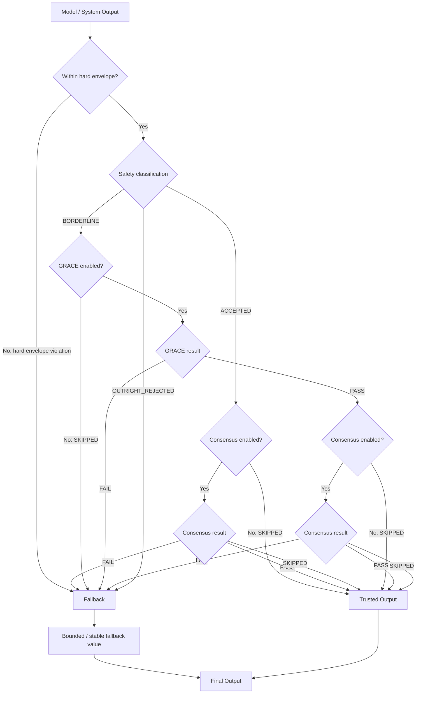

# AILEE Trust Layer — Architecture Overview

## Repository Layout

### Library (`ailee/`)
The installable Python package containing the core trust pipeline, optional modules,
domain governance layers, and backend abstractions.

### Local Computing foundation (`ailee/local_computing/`)
Domain-independent governance for consequential operating-system actions. The
`common/` package owns immutable requests, deterministic policy, capability,
enforcement, audit, and failure contracts. The `linux/`, `windows/`, and
`macos/` packages implement distinct user-space adapters selected only for the
running OS. They use the hosting process's authority and do not install kernel
code, intercept unrelated computation, create an AILEE agent framework, or
require any application domain. Policy decision, platform capability,
enforcement result, operation completion, and audit delivery remain separate
evidence dimensions.

### Rust Core (`src/`, `Cargo.toml`)
Production-grade Rust implementation providing generative AI trust scoring,
consensus engines, and cryptographic lineage verification.

### Deployment Application (`ailee/web/` + static root assets)
- `ailee/web/app.py` — FastAPI web application serving the AILEE demo
- `ailee/web/models.py` — Multi-model generation and search orchestration
- `ailee/web/formatters.py` — Output formatting (JSON, text, markdown, HTML)
- `index.html`, `script.js`, `styles.css` — Frontend chat interface
- `render.yaml` — Render.com deployment configuration

### Documentation (`docs/`)
Specification documents for the GRACE Layer, Audit Schema, Versioning Policy,
AI Integration Guide, and Rust implementation details.

### Tests (`tests/`)
Unit, integration, domain, and runtime-specific tests are distributed across the
repository. The `tests/` tree includes Python domain and pipeline suites, Rust
integration tests, and native C++ coverage; Rust modules also contain unit tests,
while the TypeScript package has its own Vitest suites.

## Trust Decision State and Routing

The following diagram describes the principal routes in the Python trust
pipeline. Consensus and GRACE are configurable: a disabled or evidence-limited
stage is represented by `SKIPPED`, while a borderline decision with GRACE
disabled follows the fallback route.

Here, a consensus `SKIPPED` result can mean that consensus was enabled but could
not be evaluated with the available peer evidence. The output remains auditable
through explicit status, reasons, and metadata.

## Separation of Concerns

The core `ailee/` package is **independently installable**. The deployable web
application lives in `ailee/web/`, while static assets and platform configuration
remain at the repository root. The deployment application imports the core
package as a consumer.

Local Computing is likewise standalone and composable: consumers submit an
explicit `CapabilityRequest` to `LocalComputingTrust`; domain packages are not
imported by that path. **AILEE governs agency, not computation.** The OS kernel
and its native permissions remain authoritative below AILEE's user-space
decision and adapter boundary.

The Python pipeline's governing decision logic is deterministic given identical
inputs, configuration, and relevant per-instance history. That guarantee applies
to decision semantics; operational metadata such as a default current timestamp
or a generated identifier can vary between executions unless the caller supplies
or controls it.
